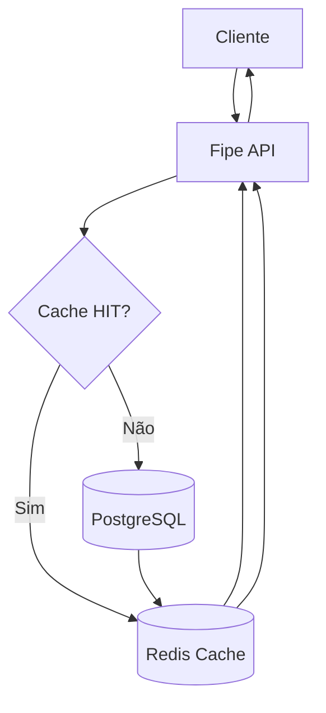

# Fipe Search Redis Cache (POC)

[](https://www.oracle.com/java/)
[](https://spring.io/projects/spring-boot)
[](https://redis.io/)
[](https://www.postgresql.org/)
[](https://k6.io/)

Esta Proof of Concept (POC) demonstra o impacto prático da implementação de uma estratégia robusta de cache distribuído com **Redis** em uma API Spring Boot de consulta à Tabela FIPE. O projeto explora cenários críticos de alta concorrência, incluindo a mitigação de gargalos de banco de dados, o fenômeno do **Cache Stampede** (ou thundering herd) e a otimização de performance por meio de **Cache Warm-up** (Aquecimento de Cache).

---

## 🛠️ Tecnologias Utilizadas

- **Java 21**
- **Spring Boot 4.0.8** (Spring Data JPA, Spring Cache, Spring WebMVC)
- **Redis 8.6** (Cache distribuído em memória)
- **PostgreSQL 18** (Banco de dados relacional simulando gargalos de conexões)
- **Grafana k6** (Automação de testes de carga e estresse)
- **Docker & Docker Compose** (Orquestração de containers)

---

## 📂 Estrutura do Projeto

O repositório está organizado separando as camadas da aplicação Spring Boot, a infraestrutura em containers e os scripts de teste de carga:

```text
fipe-search-redis-cache/
├── docker/
│   └── docker-compose.yml       # Orquestração dos containers (PostgreSQL, Redis e App)
├── loadtest/
│   └── k6-script.js             # Script de teste de carga (Grafana k6 com 200 VUs)
├── scripts/
│   └── run_poc.sh               # Script orquestrador automatizado da POC e relatórios
├── src/
│   ├── main/
│   │   ├── java/com/treinamento/fipe_search/
│   │   │   ├── FipeSearchApplication.java  # Classe principal do Spring Boot
│   │   │   ├── config/
│   │   │   │   └── CacheConfig.java        # Configuração do Redis Cache, TTL dinâmico e Warm-up
│   │   │   ├── controller/
│   │   │   │   └── FipeController.java     # Endpoints REST de consulta e invalidação
│   │   │   ├── dto/
│   │   │   │   └── ConsultaFipeDTO.java    # Record para transferência e serialização JSON
│   │   │   ├── entity/
│   │   │   │   ├── MarcaEntity.java        # Entidade JPA de Marcas
│   │   │   │   ├── ModeloEntity.java       # Entidade JPA de Modelos
│   │   │   │   └── ReferenciaEntity.java   # Entidade JPA de Referências (Preços e Anos)
│   │   │   ├── repository/
│   │   │   │   └── ReferenciaRepository.java # Repositório JPA com query otimizada e simulateDelay
│   │   │   └── service/
│   │   │       └── FipeService.java        # Regra de negócio com cache e atraso simulado
│   │   └── resources/
│   │       ├── application.properties      # Propriedades de conexão, logs e cache
│   │       └── data.sql                    # Massa de dados simulada para marcas, modelos e preços
│   │   └── test/                           # Testes unitários e de integração
├── pom.xml                          # Gerenciador de dependências Maven (Java 21, Spring Boot 4)
├── poc-results-live.md              # Relatório consolidado gerado automaticamente pela POC
└── README.md                        # Documentação principal do repositório
```

## 🔄 Fluxo de Execução da Consulta

O diagrama a seguir ilustra o comportamento do fluxo de requisições na API considerando o ciclo de vida do cache:



---

## ⚙️ Diferenciais Técnicos e Cenários Extremos

Para simular um ambiente de produção sob alto estresse, foram aplicadas as seguintes engenharia de cenários:

1. **Testes de Carga Integrados (`Grafana k6`)**: Execução automatizada via script orquestrador (`run_poc.sh`) disparando 200 Virtual Users (VUs) simultâneos focados em chaves quentes (*hot keys*).
2. **Serialização JSON no Redis**: Uso de `JacksonJsonRedisSerializer` em substituição à serialização binária padrão, permitindo leitura e inspeção direta de chaves e valores via `redis-cli` ou ferramentas visuais (*Redis for VS Code*).
3. **Estresse Forçado de TTL Curto**: O tempo de vida do cache (`TTL`) foi reduzido para **6 segundos** para forçar expirações rápidas em alta concorrência e evidenciar o fenômeno do *Cache Stampede*.
4. **Simulação de Latência no Banco (`pg_sleep`)**: Injeção proposital de `pg_sleep(0.05)` (50ms) nas consultas diretas ao banco.
5. **Gargalo de Conexões (HikariCP)**: Limitação intencional do pool de conexões do banco (`maximum-pool-size=5`) para evidenciar falhas por esgotamento de conexões sob concorrência extrema.
6. **Processo de Warm-up no Startup**: Mecanismo acionado por evento (`ApplicationReadyEvent`) que pré-carrega as 5 chaves mais acessadas no Redis logo na inicialização da aplicação.

---

## 📊 Resumo dos Resultados de Estresse

Os testes foram executados com **200 VUs durante 20 segundos** para cada cenário, utilizando o script automatizado da POC:

| Cenário testado | RPS | p95 | Erros |
| :--- | :---: | :---: | :---: |
| **Direct DB (Gargalo do pool)** | 23619 | 15.89ms | 1240 |
| **Cache c/ TTL curto (Stampede)** | 23528 | 15.36ms | 1302 |
| **Cache Aquecido (Cenário Ideal)** | 24859 | 15.73ms | 0 |

### 🔍 Análise dos Dados:
- **Direct DB**: O volume bruto foi atendido, mas a saturação do pool gerou **1.240 erros** de timeout/conexão.
- **Cache com TTL (Stampede)**: Ao expirar as chaves simultaneamente sob 200 VUs, centenas de threads dispararam *Cache MISS* ao mesmo tempo, gerando **1.500 misses** e colapsando o banco com **1.302 erros**.
- **Cache com Warm-up (Ideal)**: Com o aquecimento prévio e TTL estendido para as chaves principais, a aplicação operou com **zero erros (`0`)**, entregando a maior volumetria de requisições bem-sucedidas.

---

## 🚀 Como Executar o Projeto

### Pré-requisitos
- Docker e Docker Compose instalados.
- Java 21 e Maven instalados (ou utilizando o Maven Wrapper incluso no projeto).

### Passo a passo para rodar a POC completa:

### 1. Clonar o Repositório e Navegar até a Raiz
Abra o seu terminal (Git Bash ou PowerShell) e execute os comandos para clonar o projeto e entrar na pasta principal:
   ```bash
   git clone https://github.com/seu-usuario/fipe-search-redis-cache.git
   cd fipe-search-redis-cache
   ```
   
### 2. Subir os Bancos (Postgres e Redis)
Navegue até a pasta de infraestrutura e inicie os containers necessários utilizando o Docker Compose:       
   ```bash
   cd docker
   docker compose up -d postgres redis
   cd ..
   ```

### 3. Inicie a Aplicação Spring Boot
Com a infraestrutura ativa, compile e inicie a API utilizando o Maven Wrapper:

   - **Linux / macOS / Git Bash:**
   ```bash
   ./mvnw spring-boot:run
   ```

   - **Windows (PowerShell):**
   ```bash
   .\mvnw.cmd spring-boot:run
   ```   
   
### 4. Rodando a POC da Live (Teste de Carga Automatizado)
Com a aplicação rodando e saudável, você pode executar o script orquestrador automatizado — responsável por compilar o projeto, subir/recriar os containers, executar os cenários no Grafana k6 (simulando 200 VUs por 20 segundos em chaves quentes), coletar as métricas de performance e gerar/atualizar o relatório (poc-results-live.md):
   ```bash
   chmod +x ./run_poc.sh
   ./run_poc.sh
   ```
   
👉 Para conferir a análise detalhada e as métricas completas dos testes de carga, acesse o [Relatório da POC (poc-results-live.md)](./poc-results-live.md).
